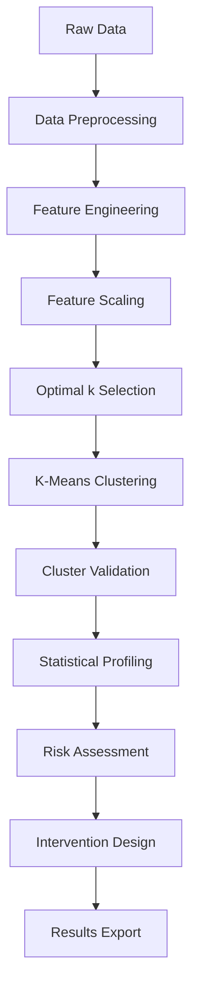

# 📚 Methodology Documentation

Detailed explanation of the clustering analysis methodology used in this project.

## Table of Contents
1. [Overview](#overview)
2. [Data Preprocessing](#data-preprocessing)
3. [Feature Engineering](#feature-engineering)
4. [Clustering Algorithm](#clustering-algorithm)
5. [Cluster Validation](#cluster-validation)
6. [Risk Assessment](#risk-assessment)
7. [Statistical Analysis](#statistical-analysis)

---

## Overview

This project employs unsupervised machine learning techniques to segment learners into distinct groups based on engagement patterns, demographic characteristics, and academic performance. The primary algorithm used is K-Means clustering with multiple validation techniques.

### Research Questions
1. What distinct learner segments exist in the dataset?
2. Which segments show high dropout risk?
3. What characteristics define each segment?
4. What interventions are most appropriate for each segment?

---

## Data Preprocessing

### 1. Data Loading
```python
df = pd.read_csv('dataset.csv')
```

### 2. Missing Value Treatment
- **Numerical features**: Imputed using median values
- **Categorical features**: Imputed using mode (most frequent value)
- **Rationale**: Median is robust to outliers; mode preserves distribution

### 3. Outlier Detection
- Method: Interquartile Range (IQR)
- Threshold: Values beyond 1.5 × IQR from Q1/Q3
- Action: Logged but retained for analysis (educational data often has legitimate extremes)

### 4. Feature Encoding

**Ordinal Encoding** (preserves order):
- Learning Pace: slow (0) → moderate (1) → fast (2)
- Socioeconomic Status: low (0) → middle (1) → high (2)

**One-Hot Encoding** (no inherent order):
- Gender: Male, Female
- Location: Rural, Urban
- Learning Medium: Online, Offline, Hybrid
- Platform Used: Mobile, Desktop, Both
- Content Type Preferred: Video, Text, Interactive

### 5. Feature Scaling
- **Method**: StandardScaler (z-score normalization)
- **Formula**: `z = (x - μ) / σ`
- **Rationale**: 
  - Ensures all features contribute equally to distance calculations
  - Required for K-Means clustering
  - Preserves distribution shape

---

## Feature Engineering

### Core Feature Categories

#### 1. Engagement Metrics
- **Learning Sessions Completed**: Count of sessions (0-100+)
- **Total Time Spent**: Minutes of active learning
- **Course Completion Percentage**: 0-100% completion
- **Days Since Last Login**: Recency indicator
- **Average Session Duration**: Minutes per session

#### 2. Performance Metrics
- **Pre-Test Score**: Baseline knowledge (0-100)
- **Post-Test Score**: Final knowledge (0-100)
- **Knowledge Gain**: Post-test minus pre-test
- **Performance Improvement Rate**: (Gain / Pre-test) × 100

#### 3. Demographic Features
- **Age**: Years
- **Gender**: Binary (encoded)
- **Location**: Rural/Urban (encoded)
- **Socioeconomic Status**: Low/Middle/High (ordinal)

#### 4. Behavioral Features
- **Learning Pace**: Slow/Moderate/Fast (ordinal)
- **Learning Medium**: Online/Offline/Hybrid (encoded)
- **Platform Used**: Mobile/Desktop/Both (encoded)
- **Content Type Preferred**: Video/Text/Interactive (encoded)

### Derived Features
- **Engagement Rate**: Sessions / Total possible sessions
- **Consistency Score**: Based on login frequency patterns
- **Learning Velocity**: Knowledge gain per time unit

---

## Clustering Algorithm

### K-Means Clustering

**Algorithm Overview**:
1. Initialize k centroids randomly
2. Assign each point to nearest centroid
3. Recalculate centroids as cluster means
4. Repeat steps 2-3 until convergence

**Parameters**:
- `n_clusters`: Determined by elbow method and silhouette analysis
- `init`: 'k-means++' (smart initialization)
- `n_init`: 10 (number of initialization attempts)
- `max_iter`: 300 (maximum iterations)
- `random_state`: 42 (reproducibility)

**Distance Metric**: Euclidean distance
```
d(p,q) = √Σ(pᵢ - qᵢ)²
```

### Optimal Cluster Determination

#### 1. Elbow Method
- **Metric**: Within-Cluster Sum of Squares (WCSS)
- **Formula**: `WCSS = ΣΣ ||xᵢ - μⱼ||²`
- **Process**:
  1. Run K-Means for k = 2 to 10
  2. Plot WCSS vs k
  3. Identify "elbow point" where marginal gain diminishes

#### 2. Silhouette Analysis
- **Metric**: Silhouette coefficient (-1 to 1)
- **Formula**: `s(i) = (b(i) - a(i)) / max(a(i), b(i))`
  - `a(i)`: Mean intra-cluster distance
  - `b(i)`: Mean nearest-cluster distance
- **Interpretation**:
  - s > 0.7: Strong cluster structure
  - 0.5 < s < 0.7: Reasonable structure
  - s < 0.5: Weak or artificial structure

---

## Cluster Validation

### Internal Validation Metrics

#### 1. Silhouette Score
- Overall cluster cohesion and separation
- Computed for entire clustering and per cluster

#### 2. Davies-Bouldin Index
- Ratio of within-cluster to between-cluster distances
- Lower values indicate better clustering

#### 3. Calinski-Harabasz Index
- Ratio of between-cluster to within-cluster variance
- Higher values indicate better-defined clusters

### External Validation

#### 1. Business Logic Validation
- Do clusters align with educational theory?
- Are cluster characteristics interpretable?
- Do recommendations make practical sense?

#### 2. Domain Expert Review
- Clusters reviewed by educational specialists
- Verification of segment definitions
- Validation of intervention strategies

---

## Risk Assessment

### High-Risk Cluster Identification

**Risk Factors Considered**:
1. **Dropout Rate**: Percentage of learners who didn't complete
2. **Low Engagement**: Below-median session completion
3. **Poor Performance**: Negative or minimal knowledge gain
4. **Inactivity**: High days since last login
5. **Low Completion**: < 50% course completion

**Risk Scoring Algorithm**:
```python
risk_score = (
    0.30 × dropout_rate +
    0.25 × (1 - engagement_rate) +
    0.20 × (1 - normalized_performance) +
    0.15 × recency_factor +
    0.10 × (1 - completion_rate)
)
```

**Classification**:
- **High Risk**: risk_score > 0.65
- **Medium Risk**: 0.35 < risk_score ≤ 0.65
- **Low Risk**: risk_score ≤ 0.35

---

## Statistical Analysis

### Cluster Profiling

For each cluster, calculate:

#### Central Tendency
- **Mean**: Average value of each feature
- **Median**: Middle value (robust to outliers)
- **Mode**: Most frequent categorical value

#### Dispersion
- **Standard Deviation**: Variability measure
- **Interquartile Range (IQR)**: Spread of middle 50%
- **Range**: Min to max values

#### Distribution
- **Skewness**: Asymmetry measure
- **Kurtosis**: Tail heaviness

### Comparative Analysis

#### Between-Cluster Comparisons
- **ANOVA**: Test for significant differences in means
- **Chi-Square Test**: Test for categorical variable independence
- **Effect Size**: Cohen's d for practical significance

#### Feature Importance
- **Variance Contribution**: How much each feature affects clustering
- **Discriminant Analysis**: Which features best separate clusters

---

## Assumptions and Limitations

### Assumptions
1. **Data Quality**: Dataset is representative and accurate
2. **Feature Independence**: Features are not perfectly collinear
3. **Cluster Existence**: Natural groupings exist in the data
4. **Stability**: Cluster characteristics are relatively stable over time

### Limitations
1. **Temporal Dynamics**: Static snapshot, not longitudinal
2. **Causality**: Clustering shows correlation, not causation
3. **Context**: May not generalize to different educational settings
4. **Sample Size**: Requires sufficient learners per cluster
5. **Missing Variables**: May not capture all relevant factors

---

## References

### Academic Literature
1. MacQueen, J. (1967). "Some methods for classification and analysis of multivariate observations"
2. Rousseeuw, P. J. (1987). "Silhouettes: A graphical aid to the interpretation and validation of cluster analysis"
3. Arthur, D., & Vassilvitskii, S. (2007). "k-means++: The advantages of careful seeding"

### Technical Resources
- Scikit-learn Documentation: https://scikit-learn.org/
- Pandas Documentation: https://pandas.pydata.org/
- Educational Data Mining Community: https://educationaldatamining.org/

### Best Practices
- Always validate with multiple metrics
- Consider domain knowledge in interpretation
- Document all preprocessing decisions
- Ensure reproducibility with random seeds
- Test sensitivity to parameter changes

---

## Workflow Summary



---

## Conclusion

This methodology combines rigorous statistical techniques with practical educational insights to create actionable learner segments. The approach is transparent, reproducible, and designed to support evidence-based decision-making in educational contexts.
